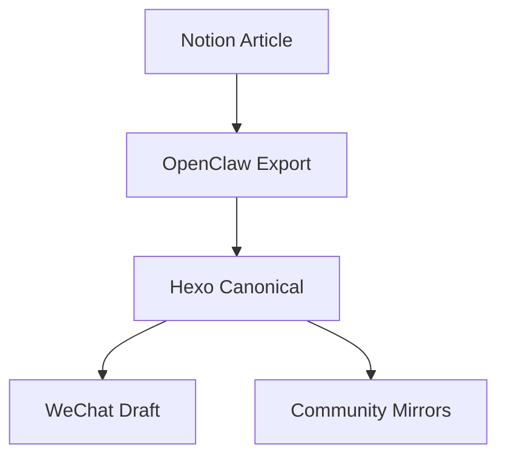

这篇文章用于校验 Hexo 站点、主题、搜索和 canonical 逻辑已经接上线。

接下来 OpenClaw 会把这里当成主源，再把文章推到公众号和各类社区。

## 为什么先抢主站

因为 canonical 不是装饰，它决定搜索归属、阅读原文、以及所有社区镜像最终往哪儿回流。

### 一个公式

当你把一篇文章丢到多个社区时，最怕的是原文地址漂移。这个阶段要的不是“多发一篇”，而是：

$$
内容资产 = 主站沉淀 \times 分发广度 \times 回流效率
$$

## Mermaid 校验

